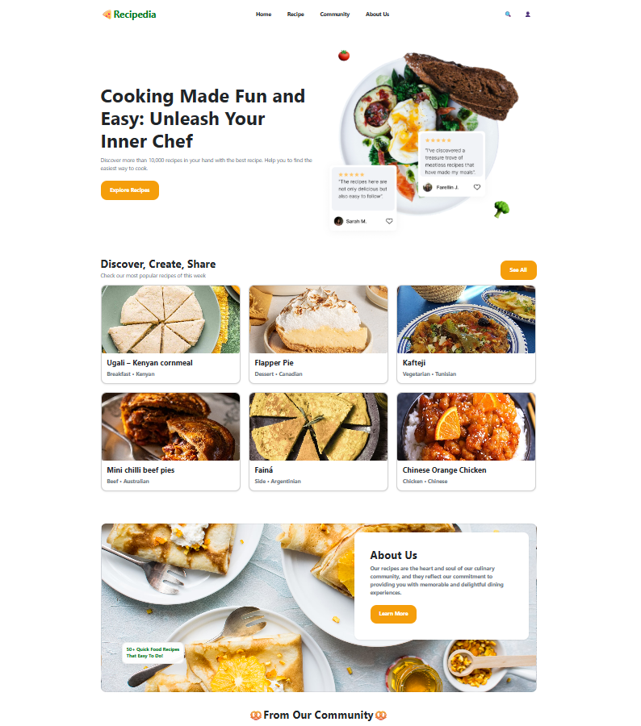
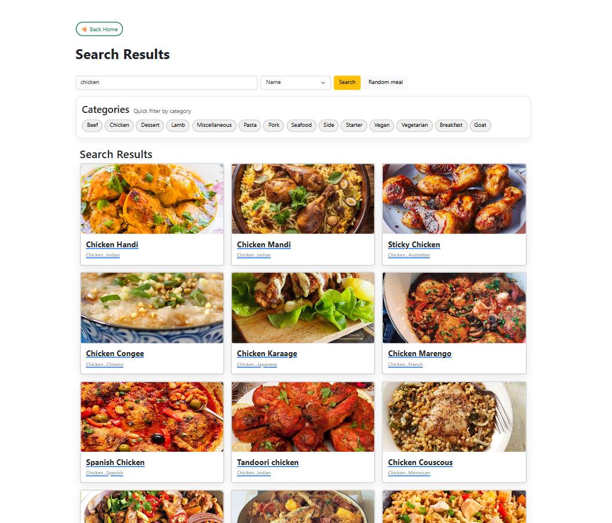
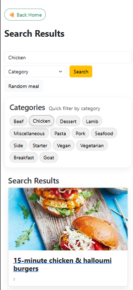
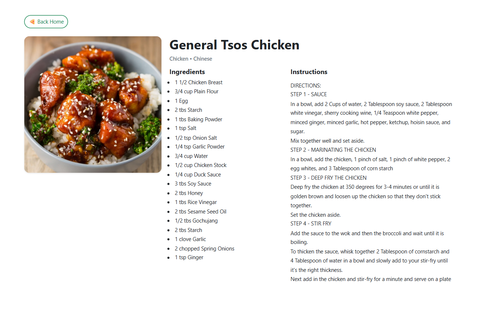

# 🍕 Recipedia — Recipe Search App (React Meal API)

A modern and responsive recipe search web application built with **React + Vite**, using the public **TheMealDB API**.  
Users can search meals, filter by name, categories, ingredients, explore random recipes, and view detailed cooking instructions.

---
## ✨ Features
- 🔍 Search meals by name, ingredient, category
- 🏷️ Filter by category (Chicken, Pasta, Seafood, etc.)
- 🎲 Random meal generator
- 📋 Detailed meal page (ingredients list + instructions)
- 📱 Fully responsive (mobile / tablet / desktop)
- ♿ Accessible-friendly UI (ARIA labels, screen-reader helpers)

## 🧰 Tech Stack

- **Vite**
- **React 18**
- **React Router**
- **Context API**
- **Bootstrap 5**
- **TheMealDB REST API**

## 🔗 API Used
Data is fetched from the public API: https://www.themealdb.com/api.php

### Endpoints used (GET method):
- `/search.php?s=chicken` - Search by name
- `/search.php?f=a`       - Search by first letter
- `/filter.php?i=Chicken` - Filter by ingredient
- `filter.php?a=Italian`  - Filter by area
- `/filter.php?c=Seafood` - Filter by category
- `/lookup.php?i=52772`   - Lookup meal by ID
- `/random.php`           - Random meal

## 🧭 Pages / Routes
| `/`         | Home page with featured meals |
| `/search`   | Search & filter meals         |
| `/meal/:id` | Single meal details page      |

## 🚀 Getting Started

- 1. Clone the repository  -  git clone https://github.com/redpanda-8/6114ReactMealApi.git
- 2. Install dependencies  -  npm install
- 3. Run the project       -  npm run dev
- 4. Open in browser:      -  http://localhost:5173

## 🧠 What I Learned

1. Working with REST APIs in React
2. React Router navigation
3. Managing global state with Context API
4. Component-based UI structure
5. Responsive UI with Bootstrap grid system
6. Conditional rendering & error handling

## 🖼️ Screenshots
### Home Page

### Search Results

### Search Results (Mobile)

### Meal Details

# React + Vite

This template provides a minimal setup to get React working in Vite with HMR and some ESLint rules.

Currently, two official plugins are available:

- [@vitejs/plugin-react](https://github.com/vitejs/vite-plugin-react/blob/main/packages/plugin-react) uses [Babel](https://babeljs.io/) (or [oxc](https://oxc.rs) when used in [rolldown-vite](https://vite.dev/guide/rolldown)) for Fast Refresh
- [@vitejs/plugin-react-swc](https://github.com/vitejs/vite-plugin-react/blob/main/packages/plugin-react-swc) uses [SWC](https://swc.rs/) for Fast Refresh

## React Compiler

The React Compiler is not enabled on this template because of its impact on dev & build performances. To add it, see [this documentation](https://react.dev/learn/react-compiler/installation).

## Expanding the ESLint configuration

If you are developing a production application, we recommend using TypeScript with type-aware lint rules enabled. Check out the [TS template](https://github.com/vitejs/vite/tree/main/packages/create-vite/template-react-ts) for information on how to integrate TypeScript and [`typescript-eslint`](https://typescript-eslint.io) in your project.

## HOW TO RUN AFTER DWNLD ZIP
Bash terminal > npm run dev